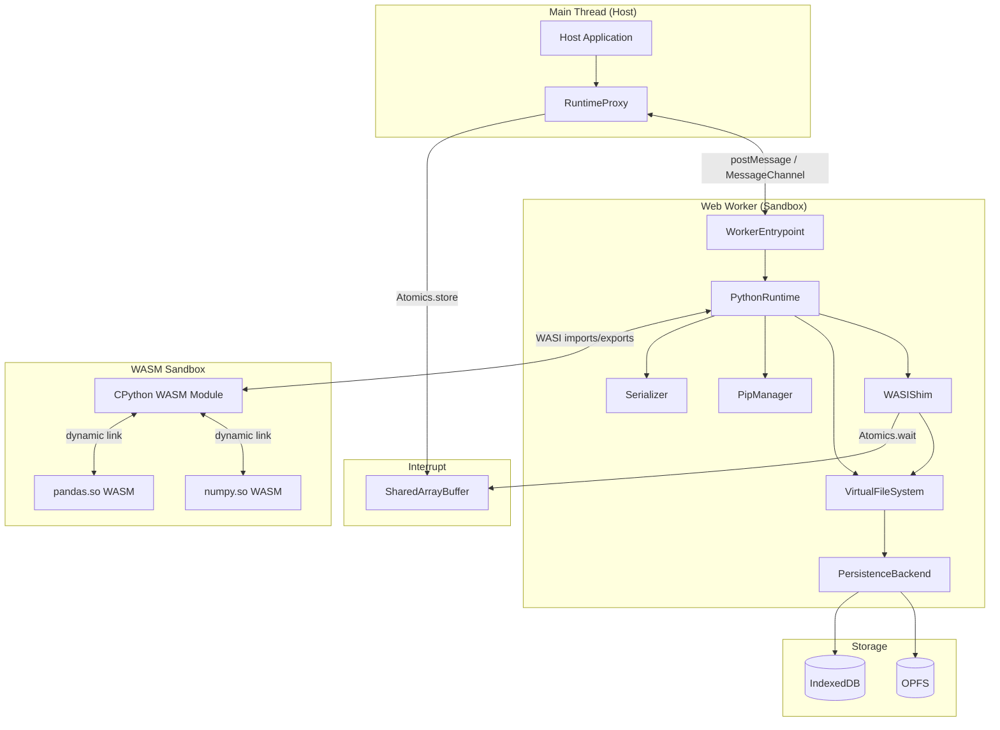
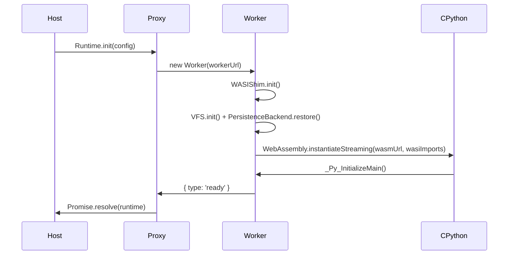
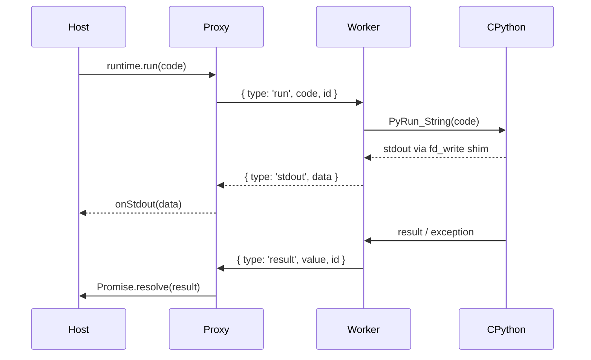

# Design Document: Python WASM Runtime

## Overview

Python WASM Runtime — это браузерная среда выполнения Python, построенная поверх CPython, скомпилированного в WebAssembly через wasi-sdk (wasm32-wasi target). Архитектура принципиально отличается от Pyodide: вместо Emscripten используется чистый WASI-слой, что даёт более предсказуемое поведение системных вызовов и лучшую совместимость с экосистемой WASI.

### Ключевые архитектурные решения

- **CPython + wasi-sdk** вместо Emscripten: WASI — стандартный системный интерфейс, CPython поддерживает его как Tier 2 платформу начиная с Python 3.13 ([PEP 816](https://peps.python.org/pep-0816/))
- **Один Worker = один Runtime**: полная изоляция через WASM linear memory, без разделяемого состояния между экземплярами
- **OPFS как primary persistence**: `FileSystemSyncAccessHandle` в Web Worker даёт синхронный доступ к файлам без блокировки main thread
- **SharedArrayBuffer + Atomics** для interrupt механизма: единственный надёжный способ прервать выполнение WASM из внешнего контекста
- **Динамическая загрузка WASM-модулей** для C-extensions: каждый `.so` — отдельный WASM-модуль, линкуемый через custom import hook

### Исследовательские находки

1. **CPython WASM/WASI статус**: CPython 3.13+ поддерживает wasm32-wasi как Tier 2 платформу. Официальные сборки доступны через [brettcannon/cpython-wasi-build](https://github.com/brettcannon/cpython-wasi-build). Stdlib включается в сборку.

2. **WASI Shim**: Существует референсная реализация [@bjorn3/browser_wasi_shim](https://www.npmjs.com/package/@bjorn3/browser_wasi_shim), реализующая подмножество `wasi_snapshot_preview1`. Наш shim расширяет её для поддержки всех syscalls, необходимых CPython.

3. **OPFS + Web Worker**: `FileSystemSyncAccessHandle` доступен только в Web Worker и предоставляет синхронный I/O — критично для WASI, где файловые операции синхронны. Поддерживается всеми major браузерами с 2023 года.

4. **Interrupt механизм**: `SharedArrayBuffer` + `Atomics.wait()` в Worker позволяет main thread сигнализировать Worker о необходимости прервать выполнение. Требует COOP/COEP заголовков (`Cross-Origin-Opener-Policy: same-origin`, `Cross-Origin-Embedder-Policy: require-corp`).

5. **Динамическая линковка WASM**: C-extensions компилируются как отдельные WASM-модули с экспортом Python C API функций. CPython custom import hook перехватывает `import` для `.so`-файлов и вызывает `WebAssembly.instantiate()` с таблицей функций CPython.

---

## Architecture



### Поток инициализации



### Поток выполнения кода



---

## Components and Interfaces

### RuntimeProxy (Main Thread)

Тонкая обёртка на main thread. Создаёт Worker, управляет жизненным циклом, маршрутизирует вызовы через `MessageChannel`.

```typescript
interface RuntimeConfig {
  pythonVersion?: string;           // default: "3.13"
  wasmUrl?: string;                 // URL к .wasm бинарнику
  persistenceBackend?: 'opfs' | 'indexeddb' | 'none';
  autoSyncInterval?: number;        // ms, 0 = disabled
  executionTimeout?: number;        // ms, default: 30000
  allowedSyscalls?: string[];       // whitelist WASI syscalls
}

interface RuntimeProxy {
  init(config: RuntimeConfig): Promise<void>;
  run(code: string, options?: RunOptions): Promise<RunResult>;
  interrupt(): void;
  restart(): Promise<void>;
  destroy(): Promise<void>;
  getMemoryUsage(): Promise<MemoryUsage>;
  getConfig(): RuntimeConfig;
  fs: FSProxy;
  pip: PipProxy;
  onStdout: (data: string) => void;
  onStderr: (data: string) => void;
  onWarning: (warning: RuntimeWarning) => void;
  onMemoryWarning: (usage: MemoryUsage) => void;
}

interface RunOptions {
  globals?: Record<string, unknown>;
  timeout?: number;
}

interface RunResult {
  value: unknown;
  error?: PythonError;
}

interface PythonError {
  type: string;
  message: string;
  traceback: string;
}

interface MemoryUsage {
  wasmHeap: number;
  vfsSize: number;
}
```

### WASIShim (Worker)

Реализует `wasi_snapshot_preview1` import object для `WebAssembly.instantiate()`. Все файловые операции делегируются в VFS. Stdout/stderr перехватываются через callbacks.

```typescript
interface WASIShim {
  // Генерирует import object для WebAssembly.instantiate
  buildImports(vfs: VirtualFileSystem, callbacks: WASICallbacks): WASIImports;
  
  // Interrupt: проверяет SharedArrayBuffer на каждом syscall
  setInterruptBuffer(sab: SharedArrayBuffer): void;
}

interface WASICallbacks {
  onStdout: (data: Uint8Array) => void;
  onStderr: (data: Uint8Array) => void;
  onUnknownSyscall: (name: string) => void;
}

// Реализуемые syscalls (wasi_snapshot_preview1):
// fd_read, fd_write, fd_seek, fd_close, fd_fdstat_get
// path_open, path_create_directory, path_remove_directory
// path_unlink_file, path_rename, path_filestat_get
// path_readdir, clock_time_get, random_get
// proc_exit, args_get, args_sizes_get, environ_get, environ_sizes_get
```

**Реализация interrupt**: На каждом вызове `fd_write` (и периодически в `clock_time_get`) shim проверяет `Atomics.load(interruptBuffer, 0)`. Если значение ненулевое — бросает исключение, которое CPython перехватывает как `KeyboardInterrupt`.

### VirtualFileSystem (Worker)

In-memory файловая система с POSIX-семантикой. Хранит файлы как `Map<string, VFSNode>`.

```typescript
interface VFSNode {
  type: 'file' | 'directory';
  content?: Uint8Array;    // только для файлов
  children?: Set<string>;  // только для директорий
  mtime: number;
  size: number;
}

interface VirtualFileSystem {
  // WASI-level операции (вызываются из WASIShim)
  pathOpen(path: string, flags: number): FileDescriptor;
  fdRead(fd: FileDescriptor, iovs: IoVec[]): number;
  fdWrite(fd: FileDescriptor, iovs: IoVec[]): number;
  fdSeek(fd: FileDescriptor, offset: bigint, whence: number): bigint;
  fdClose(fd: FileDescriptor): void;
  pathStat(path: string): FileStat;
  pathCreateDirectory(path: string): void;
  pathRemoveDirectory(path: string): void;
  pathUnlinkFile(path: string): void;
  pathRename(oldPath: string, newPath: string): void;
  pathReaddir(path: string): DirEntry[];

  // Host-level операции (вызываются из Worker через postMessage)
  writeFile(path: string, content: Uint8Array | string): void;
  readFile(path: string): Uint8Array;
  listDir(path: string): DirListing[];
  sync(): Promise<void>;
  clearPersistent(): Promise<void>;
}

interface DirListing {
  name: string;
  isDirectory: boolean;
  size: number;
}
```

**Предустановленная структура при инициализации:**
```
/
├── home/user/          ← персистентная директория
├── tmp/                ← временные файлы
├── usr/
│   └── lib/
│       └── python3.x/  ← stdlib (монтируется из WASM bundle)
└── usr/local/
    └── lib/
        └── python3.x/
            └── site-packages/  ← установленные пакеты
```

### PersistenceBackend (Worker)

Абстракция над OPFS и IndexedDB. Выбирается автоматически при инициализации.

```typescript
interface PersistenceBackend {
  type: 'opfs' | 'indexeddb' | 'none';
  save(path: string, content: Uint8Array): Promise<void>;
  load(path: string): Promise<Uint8Array | null>;
  delete(path: string): Promise<void>;
  listAll(): Promise<string[]>;
  clear(): Promise<void>;
}
```

**OPFS реализация**: Использует `FileSystemSyncAccessHandle` (доступен только в Worker) для синхронных операций. Файлы хранятся в OPFS с тем же путём, что и в VFS.

**IndexedDB реализация**: Хранит файлы как blob-записи в object store `vfs-files`. Ключ — путь файла, значение — `Uint8Array`.

**Выбор бэкенда**:
```typescript
async function detectBackend(): Promise<PersistenceBackend> {
  try {
    const root = await navigator.storage.getDirectory();
    // OPFS доступен
    return new OPFSBackend(root);
  } catch {
    try {
      // Проверяем IndexedDB
      await testIndexedDB();
      return new IndexedDBBackend();
    } catch {
      return new NoPersistenceBackend();
    }
  }
}
```

### WASMExtensionLoader (Worker)

Управляет динамической загрузкой C-extensions как отдельных WASM-модулей.

```typescript
interface WASMExtensionLoader {
  // Регистрирует .so файл как WASM-модуль
  register(soPath: string, wasmBytes: Uint8Array): void;
  
  // Загружает и линкует модуль с CPython
  // Вызывается из Python import hook
  load(moduleName: string): PyObject;
  
  // Реестр pre-compiled wheels
  registry: WASMWheelRegistry;
}

interface WASMWheelRegistry {
  packages: Map<string, WASMWheelEntry>;
  resolve(name: string, version?: string): WASMWheelEntry | null;
}

interface WASMWheelEntry {
  name: string;
  version: string;
  url: string;
  sha256: string;
  dependencies: string[];
}
```

**Механизм линковки**: C-extension WASM-модуль импортирует функции CPython C API (`PyArg_ParseTuple`, `PyLong_FromLong` и т.д.) из таблицы функций главного CPython WASM-модуля. При `WebAssembly.instantiate()` передаётся `importObject` с экспортами CPython.

### PipManager (Worker)

```typescript
interface PipManager {
  install(packages: string | string[]): Promise<InstallResult[]>;
  list(): Promise<PackageInfo[]>;
}

interface InstallResult {
  name: string;
  version: string;
  source: 'wasm-registry' | 'pypi';
}

interface PackageInfo {
  name: string;
  version: string;
}
```

**Алгоритм установки**:
1. Проверить кэш в `/tmp/pip-cache/`
2. Проверить реестр WASM Wheels → скачать wheel, распаковать в `site-packages`
3. Если не найден в реестре → запросить PyPI JSON API → проверить наличие pure-Python wheel
4. Если только C-extension wheels для других платформ → `IncompatiblePackageError`
5. Установить зависимости рекурсивно

### Serializer

Двунаправленная сериализация JS ↔ Python через JSON-совместимый промежуточный формат.

```typescript
interface Serializer {
  // JS → Python (передаётся как JSON строка в CPython)
  jsToJson(value: unknown): string;
  
  // Python → JS (парсит JSON строку из CPython)
  jsonToJs(json: string): unknown;
  
  // Специальный маркер для non-serializable Python объектов
  readonly PYTHON_OBJECT_MARKER = '__python_object__';
}
```

**Таблица маппинга типов:**

| JavaScript | Python |
|-----------|--------|
| `Object` | `dict` |
| `Array` | `list` |
| `number` (целое) | `int` |
| `number` (дробное) | `float` |
| `string` | `str` |
| `null` / `undefined` | `None` |
| `boolean` | `bool` |
| `{ __type: 'python-object', repr: string }` | (non-serializable) |

**Ограничение глубины**: Рекурсивный обход с счётчиком глубины. При превышении 100 уровней — `SerializationDepthError`.

### ConfigParser

```typescript
interface ConfigParser {
  parse(raw: unknown): RuntimeConfig;
  validate(config: RuntimeConfig): ValidationResult;
  serialize(config: RuntimeConfig): Record<string, unknown>;
}

const CONFIG_SCHEMA: Record<keyof RuntimeConfig, { type: string; default: unknown }> = {
  pythonVersion:      { type: 'string',  default: '3.13' },
  wasmUrl:            { type: 'string',  default: null },
  persistenceBackend: { type: 'string',  default: 'opfs' },
  autoSyncInterval:   { type: 'number',  default: 5000 },
  executionTimeout:   { type: 'number',  default: 30000 },
  allowedSyscalls:    { type: 'array',   default: null },
};
```

---

## Data Models

### Внутренние структуры VFS

```typescript
// Файловый дескриптор
interface FileDescriptor {
  fd: number;
  path: string;
  flags: OpenFlags;
  position: bigint;
  node: VFSNode;
}

// Метаданные файла (WASI filestat)
interface FileStat {
  dev: bigint;
  ino: bigint;
  filetype: FileType;  // REGULAR_FILE | DIRECTORY | SYMLINK
  nlink: bigint;
  size: bigint;
  atim: bigint;        // nanoseconds
  mtim: bigint;
  ctim: bigint;
}

// Запись директории
interface DirEntry {
  next: bigint;
  ino: bigint;
  namelen: number;
  type: FileType;
  name: string;
}
```

### Worker Message Protocol

Все сообщения между Proxy и Worker типизированы:

```typescript
// Proxy → Worker
type WorkerRequest =
  | { type: 'run';     id: string; code: string; globals?: string }
  | { type: 'restart'; id: string }
  | { type: 'destroy'; id: string }
  | { type: 'fs.write';   id: string; path: string; content: Uint8Array }
  | { type: 'fs.read';    id: string; path: string }
  | { type: 'fs.list';    id: string; path: string }
  | { type: 'fs.sync';    id: string }
  | { type: 'fs.clear';   id: string }
  | { type: 'pip.install'; id: string; packages: string[] }
  | { type: 'pip.list';    id: string }
  | { type: 'memory';      id: string };

// Worker → Proxy
type WorkerResponse =
  | { type: 'ready' }
  | { type: 'result';  id: string; value: string }
  | { type: 'error';   id: string; error: PythonError }
  | { type: 'stdout';  data: string }
  | { type: 'stderr';  data: string }
  | { type: 'warning'; code: string; message: string }
  | { type: 'fs.result';  id: string; value: unknown }
  | { type: 'pip.result'; id: string; value: unknown }
  | { type: 'memory.result'; id: string; value: MemoryUsage };
```

### RuntimeConfig (полная схема)

```typescript
interface RuntimeConfig {
  pythonVersion: string;           // "3.13"
  wasmUrl: string | null;          // null = использовать CDN default
  persistenceBackend: 'opfs' | 'indexeddb' | 'none';
  autoSyncInterval: number;        // ms, 0 = disabled
  executionTimeout: number;        // ms
  allowedSyscalls: string[] | null; // null = все разрешены
}
```

### WASM Wheel Registry Entry

```typescript
interface WASMWheelEntry {
  name: string;           // "numpy"
  version: string;        // "1.26.4"
  url: string;            // CDN URL к .whl файлу
  sha256: string;         // контрольная сумма
  pythonVersion: string;  // "cp313"
  platform: string;       // "wasm32_wasi"
  dependencies: string[]; // ["packaging"]
  soFiles: string[];      // ["numpy/core/_multiarray_umath.so"]
}
```

---

## Correctness Properties


*A property is a characteristic or behavior that should hold true across all valid executions of a system — essentially, a formal statement about what the system should do. Properties serve as the bridge between human-readable specifications and machine-verifiable correctness guarantees.*

### Property 1: Идемпотентность инициализации

*For any* Runtime экземпляра, вызов `Runtime.init()` несколько раз подряд должен приводить к тому, что WASM-модуль загружается ровно один раз, а каждый последующий вызов возвращает тот же экземпляр без повторной загрузки.

**Validates: Requirements 1.5**

---

### Property 2: Маршрутизация fd_write по файловому дескриптору

*For any* байтовой последовательности, записанной через `fd_write` в файловый дескриптор 1 (stdout) или 2 (stderr), WASI Shim должен передавать эти данные в соответствующий callback (`onStdout` для fd=1, `onStderr` для fd=2) без потерь и без смешивания потоков.

**Validates: Requirements 2.2, 2.3**

---

### Property 3: Монотонность clock_time_get

*For any* последовательности вызовов `clock_time_get`, каждое последующее возвращаемое значение должно быть больше или равно предыдущему (монотонно неубывающее время).

**Validates: Requirements 2.4**

---

### Property 4: ENOSYS для неизвестных syscalls

*For any* имени функции, не входящего в реализованный набор WASI syscalls, вызов этой функции через WASI Shim должен возвращать код ошибки `ENOSYS`.

**Validates: Requirements 2.6**

---

### Property 5: Round-trip чтения/записи VFS

*For any* валидного пути в VFS и любого байтового содержимого, операция `writeFile(path, content)` с последующим `readFile(path)` должна возвращать байтовую последовательность, идентичную исходной.

**Validates: Requirements 3.2, 3.3, 3.6, 3.7**

---

### Property 6: FileNotFoundError для несуществующих путей

*For any* пути, который не был предварительно записан в VFS, вызов `readFile(path)` должен отклонять Promise с ошибкой типа `FileNotFoundError`, содержащей этот путь.

**Validates: Requirements 3.8**

---

### Property 7: Полнота listDir

*For any* директории и любого набора файлов, созданных в ней, вызов `listDir(path)` должен возвращать массив, содержащий запись для каждого созданного файла с корректными полями `name`, `isDirectory` и `size`.

**Validates: Requirements 3.9**

---

### Property 8: Изоляция VFS между экземплярами Runtime

*For any* двух независимых экземпляров Runtime, файл, записанный в VFS одного экземпляра, не должен быть доступен через `readFile()` другого экземпляра.

**Validates: Requirements 3.10, 9.2**

---

### Property 9: Round-trip персистентности VFS

*For any* набора файлов, записанных в `/home/user/` и сохранённых через `fs.sync()`, повторная инициализация Runtime для того же origin должна восстанавливать все эти файлы с идентичным содержимым.

**Validates: Requirements 4.4, 4.5**

---

### Property 10: Очистка персистентных данных

*For any* набора файлов, сохранённых через `fs.sync()`, вызов `fs.clearPersistent()` с последующей повторной инициализацией Runtime должен приводить к тому, что ни один из ранее сохранённых файлов не восстанавливается.

**Validates: Requirements 4.7**

---

### Property 11: NoWASMWheelError для отсутствующих пакетов

*For any* имени пакета, отсутствующего в реестре WASM Wheels и не имеющего pure-Python wheel на PyPI, вызов `pip.install(name)` должен отклонять Promise с ошибкой типа `NoWASMWheelError`, содержащей имя пакета.

**Validates: Requirements 5.6**

---

### Property 12: PackageNotFoundError для несуществующих пакетов

*For any* имени пакета, которого нет ни в реестре WASM Wheels, ни на PyPI, вызов `pip.install(name)` должен отклонять Promise с ошибкой типа `PackageNotFoundError`, содержащей имя пакета.

**Validates: Requirements 6.3**

---

### Property 13: Топологический порядок установки зависимостей

*For any* набора пакетов с зависимостями (DAG), вызов `pip.install(packages[])` должен устанавливать каждую зависимость до пакета, который от неё зависит, и итоговый `pip.list()` должен содержать все пакеты и их зависимости.

**Validates: Requirements 6.5, 6.6**

---

### Property 14: Кэширование wheels при повторной установке

*For any* пакета, установленного хотя бы один раз, повторный вызов `pip.install(name)` не должен инициировать новые сетевые запросы (fetch вызывается не более одного раза суммарно).

**Validates: Requirements 6.7**

---

### Property 15: Корректность результата выполнения Python-кода

*For any* валидного Python-выражения, возвращающего примитивное значение (число, строку, булево, None), `Runtime.run(code)` должен возвращать JavaScript-значение, структурно эквивалентное результату вычисления этого выражения.

**Validates: Requirements 7.1**

---

### Property 16: Структура объекта ошибки Python

*For any* Python-кода, завершающегося исключением, `Runtime.run(code)` должен возвращать объект, содержащий непустые поля `type` (тип исключения), `message` (сообщение) и `traceback` (полный traceback).

**Validates: Requirements 7.2**

---

### Property 17: Сохранение состояния между вызовами run()

*For any* имени переменной и значения, присвоенного в одном вызове `run()`, последующий вызов `run()` в том же экземпляре Runtime должен видеть эту переменную с тем же значением.

**Validates: Requirements 7.3**

---

### Property 18: Перехват потоков вывода

*For any* строки, выведенной Python-кодом в `sys.stdout` через `print()`, соответствующий callback `onStdout` должен получить эту строку; аналогично для `sys.stderr` и `onStderr`.

**Validates: Requirements 7.4, 7.5**

---

### Property 19: Доступность globals в Python-пространстве имён

*For any* JavaScript-объекта, переданного в `Runtime.run(code, { globals })`, каждый ключ этого объекта должен быть доступен в Python-коде как переменная с корректно сериализованным значением.

**Validates: Requirements 7.7**

---

### Property 20: Round-trip сериализации JS ↔ Python

*For any* JavaScript-значения примитивного типа или вложенной структуры (Object, Array, number, string, boolean, null) глубиной до 100 уровней, преобразование JS → Python → JS должно возвращать значение, структурно эквивалентное исходному.

**Validates: Requirements 8.1, 8.2, 8.3, 8.4**

---

### Property 21: Маркировка non-serializable Python объектов

*For any* Python-объекта, не имеющего прямого JavaScript-эквивалента (пользовательский класс, генератор, функция), сериализатор должен возвращать объект с полями `__type: 'python-object'` и непустым `repr`.

**Validates: Requirements 8.5**

---

### Property 22: EPERM для запрещённых syscalls

*For any* имени WASI syscall, не входящего в список `allowedSyscalls` конфигурации Runtime, попытка вызова этого syscall из Python-кода должна возвращать код ошибки `EPERM`.

**Validates: Requirements 9.4**

---

### Property 23: Отклонение вызовов после destroy()

*For any* метода Runtime (run, restart, fs.readFile, pip.install и т.д.), вызванного после `Runtime.destroy()`, этот вызов должен отклонять Promise с ошибкой типа `RuntimeDestroyedError`.

**Validates: Requirements 9.6, 9.7**

---

### Property 24: Сброс состояния при restart() с сохранением VFS

*For any* набора Python-переменных, установленных до вызова `Runtime.restart()`, после перезапуска ни одна из этих переменных не должна быть доступна в Python-пространстве имён; при этом файлы, существовавшие в VFS до restart(), должны оставаться доступными.

**Validates: Requirements 10.1**

---

### Property 25: Корректность getMemoryUsage()

*For any* набора файлов, добавленных в VFS, значение `vfsSize` из `Runtime.getMemoryUsage()` должно быть больше нуля и увеличиваться при добавлении новых файлов.

**Validates: Requirements 10.4**

---

### Property 26: Round-trip конфигурации Runtime

*For any* валидного объекта `RuntimeConfig`, переданного в `Runtime.init(config)`, последующий вызов `Runtime.getConfig()` должен возвращать объект, структурно эквивалентный исходному по всем известным полям.

**Validates: Requirements 11.1, 11.4, 11.5**

---

### Property 27: Игнорирование неизвестных полей конфигурации

*For any* валидного `RuntimeConfig`, дополненного произвольным набором неизвестных полей, `Runtime.init()` должен успешно инициализироваться (не бросать ошибку), а неизвестные поля должны быть проигнорированы.

**Validates: Requirements 11.2**

---

### Property 28: ConfigValidationError для некорректных типов полей

*For any* поля конфигурации `RuntimeConfig` и значения неправильного типа для этого поля, `Runtime.init()` должен отклонять Promise с ошибкой типа `ConfigValidationError`, содержащей имя некорректного поля.

**Validates: Requirements 11.3**

---

## Error Handling

### Иерархия ошибок

```
RuntimeError (base)
├── InitializationError
│   ├── WASMLoadError          — ошибка загрузки .wasm (HTTP статус, URL)
│   └── ConfigValidationError  — некорректная конфигурация (поле, ожидаемый тип)
├── ExecutionError
│   ├── PythonException        — исключение Python (type, message, traceback)
│   └── ExecutionTimeoutError  — превышен таймаут выполнения
├── FSError
│   ├── FileNotFoundError      — файл не найден (путь)
│   └── FSOperationError       — общая ошибка файловой операции
├── PackageError
│   ├── PackageNotFoundError   — пакет не найден (имя)
│   ├── NoWASMWheelError       — нет WASM wheel (имя, ссылка на реестр)
│   └── IncompatiblePackageError — несовместимая платформа (имя, причина)
├── SerializationError
│   └── SerializationDepthError — превышена глубина вложенности
└── RuntimeDestroyedError      — Runtime уничтожен
```

### Стратегии обработки ошибок

| Ситуация | Поведение | Тип ошибки |
|----------|-----------|------------|
| Сетевая ошибка при загрузке WASM | Reject Promise | `WASMLoadError` с HTTP статусом и URL |
| Python исключение в run() | Resolve с error объектом | `{ type, message, traceback }` |
| Таймаут выполнения | Reject Promise | `ExecutionTimeoutError` |
| Файл не найден в VFS | Reject Promise | `FileNotFoundError` с путём |
| Нереализованный WASI syscall | Возврат ENOSYS + console.warn | — |
| Запрещённый WASI syscall | Возврат EPERM | — |
| OPFS и IndexedDB недоступны | Инициализация без персистентности | `onWarning(PERSISTENCE_UNAVAILABLE)` |
| Потребление памяти > 2 ГБ | Событие | `onMemoryWarning` |
| Вызов метода после destroy() | Reject Promise | `RuntimeDestroyedError` |
| Некорректный тип в конфиге | Reject Promise | `ConfigValidationError` с именем поля |

### Обработка ошибок в Worker

Все необработанные исключения в Worker перехватываются через `self.onerror` и `self.onunhandledrejection`, сериализуются и отправляются в Proxy как `{ type: 'error', id, error }`.

---

## Testing Strategy

### Подход к тестированию

Используется двойная стратегия: unit-тесты для конкретных примеров и граничных условий, property-based тесты для универсальных свойств.

**Property-based testing библиотека**: [fast-check](https://fast-check.io/) (TypeScript/JavaScript)

### Unit-тесты

Покрывают конкретные сценарии:
- Успешная инициализация Runtime с mock WASM модулем
- Монтирование stdlib при инициализации (Requirement 1.7)
- Предустановленная структура директорий VFS (Requirement 3.5)
- Обработка ошибки сети при загрузке WASM (Requirement 1.3)
- Выбор OPFS/IndexedDB/none бэкенда (Requirements 4.1, 4.2, 4.6)
- Установка пакета из mock реестра (Requirements 5.1, 6.1)
- Перехват pip.main() (Requirement 6.8)
- Таймаут выполнения (Requirement 7.6)
- Interrupt через SharedArrayBuffer (Requirement 10.2)
- Завершение Worker в течение 5 секунд (Requirement 10.3)
- onMemoryWarning при превышении 2 ГБ (Requirement 10.5)
- IncompatiblePackageError для non-wasm wheels (Requirement 6.4)

### Property-based тесты

Каждый property-based тест запускается минимум **100 итераций** с генерацией случайных входных данных.

Тег формата: `Feature: python-wasm-runtime, Property {N}: {краткое описание}`

| Property | Генераторы fast-check | Что проверяется |
|----------|----------------------|-----------------|
| P1: Идемпотентность init() | `fc.integer({ min: 2, max: 10 })` (кол-во вызовов) | instantiateStreaming вызван ровно 1 раз |
| P2: fd_write routing | `fc.uint8Array()`, `fc.constantFrom(1, 2)` | данные попадают в правильный callback |
| P3: Монотонность clock | `fc.integer({ min: 2, max: 50 })` (кол-во вызовов) | каждое значение ≥ предыдущего |
| P4: ENOSYS для неизвестных | `fc.string()` (имя функции) | возвращается ENOSYS |
| P5: VFS round-trip | `fc.string()` (путь), `fc.uint8Array()` (содержимое) | readFile === writeFile content |
| P6: FileNotFoundError | `fc.string()` (несуществующий путь) | ошибка содержит путь |
| P7: Полнота listDir | `fc.array(fc.string())` (имена файлов) | все файлы в результате |
| P8: Изоляция VFS | `fc.string()` (путь), `fc.uint8Array()` | файл недоступен в другом Runtime |
| P9: Persistence round-trip | `fc.array(fc.tuple(fc.string(), fc.uint8Array()))` | данные восстанавливаются после reinit |
| P10: Очистка persistence | `fc.array(fc.tuple(fc.string(), fc.uint8Array()))` | данные не восстанавливаются после clear |
| P11: NoWASMWheelError | `fc.string()` (имя пакета) | ошибка содержит имя |
| P12: PackageNotFoundError | `fc.string()` (имя пакета) | ошибка содержит имя |
| P13: Порядок зависимостей | `fc.array(fc.record(...))` (DAG пакетов) | зависимости установлены до зависимых |
| P14: Кэширование wheels | `fc.string()` (имя пакета) | fetch вызван ≤ 1 раза |
| P15: Результат run() | `fc.oneof(fc.integer(), fc.string(), fc.boolean())` | результат эквивалентен Python-значению |
| P16: Структура ошибки | `fc.string()` (код с исключением) | type/message/traceback непусты |
| P17: Сохранение состояния | `fc.string()` (имя переменной), `fc.jsonValue()` | переменная видна в следующем run() |
| P18: Перехват stdout/stderr | `fc.string()` (строка для print) | onStdout получает строку |
| P19: globals в Python | `fc.dictionary(fc.string(), fc.jsonValue())` | все ключи доступны в Python |
| P20: Serialization round-trip | `fc.jsonValue()` (глубина ≤ 100) | JS→Python→JS эквивалентно |
| P21: Non-serializable маркер | Python объекты без JS-эквивалента | `__type: 'python-object'` присутствует |
| P22: EPERM для запрещённых | `fc.string()` (syscall не из whitelist) | возвращается EPERM |
| P23: Отклонение после destroy | `fc.constantFrom('run', 'restart', 'fs.readFile', ...)` | RuntimeDestroyedError |
| P24: restart() сброс + VFS | `fc.dictionary(fc.string(), fc.jsonValue())` | переменные сброшены, файлы сохранены |
| P25: getMemoryUsage() | `fc.array(fc.uint8Array())` (файлы) | vfsSize растёт |
| P26: Config round-trip | `fc.record(...)` (валидный RuntimeConfig) | getConfig() эквивалентен init() config |
| P27: Игнорирование неизвестных полей | `fc.dictionary(fc.string(), fc.anything())` | init() не бросает ошибку |
| P28: ConfigValidationError | `fc.record(...)` (поле с неправильным типом) | ошибка содержит имя поля |

### Интеграционные тесты

- CORS блокировка cross-origin запросов из Python (Requirement 9.3)
- End-to-end: init → install numpy → import numpy → run computation
- Persistence: запись → перезагрузка страницы → восстановление данных

### Требования к окружению

- **COOP/COEP заголовки** обязательны для `SharedArrayBuffer` (interrupt механизм)
- Тесты Worker-компонентов запускаются в jsdom с mock Worker API или в реальном браузере через Playwright
- WASM-модуль в тестах заменяется на mock с минимальной реализацией CPython API
